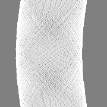

# DeepHoughTransform

~~Add training codes into Hanqer/deep-hough-transform.~~

### Brief 
- ~~Since there are no training codes in the original repo, I decided to add some training codes.~~
- I considered to use the architecture of deep-hough-transform to train on my own task. The task is not actually similar to the task of `Semantic Line Detection`.
- ~~This repo is just an attempt of writing the training codes. No plan to open my dataset or evaluate the model.~~
- _(In Chinese):_ 这条用中文再啰嗦叙述一下，因为我个人目前的工作想要考虑看一下这个deep hough transform的方法能不能用在我的数据集上，但是他这个没有训练代码啊，自己试着写一下。
- 多说一句，看代码的时候我发现trainset的设置（数据读取、transform）作者闭源了，另外label和loss计算也都闭源了，所以我考虑这两个点是有比较重点的tricks。

### Requirements
- Developed under `Pytorch1.3 Python3.6`

### Remarks
- 看了一下作者的代码，forward.py里面写的很清楚了，网络前向输出的是keypoints。
这个keypoints就是HoughLineTransform之后的那个参数空间的map，
因为HoughLineTransform其实本质上就是在一个二维图上面，
每个点表示一根直线，原图片上有点在这个直线上的话就给这根线“投票”一次，
所以最后的这个map，最大值可能有几百上千。因此前向输出后再接了一个sigmoid映射到1以内。
- 我看了作者的c_dht的实现，似乎是没有进行参数学习的，只是写成了深度网络的层，
所以测试了一下如果直接输入一个二值化的图，上面只有一根直线，输出的结果上确实有一个“能量最大”的点，这个点可以作为学习的对象；
但我的工作其实是想语义性的识别圆，如果输入的是圆的二值化的图，输出的结果图就会是：

这样的图片没法学啊。后来想了一下因为映射方法固定了，作者原始的课题就是做直线，那就是映射到Hough直线变换后的空间，这个空间不是给圆设计的。
因此如果我要进行类似的圆的检测，必须自己设计一个参数空间，然后自己设计一个c_dhct(deep hough circle transform)嵌到网络中进行训练。
（所以这个项目的后续开发可能不会有了，目前已经写了的可以po出来看看有没有人需要的）
P.S.原文说可以扩展做arbitrary shapes的课题，其实还是有局限性吧……

### TODOs
- Not finished yet

